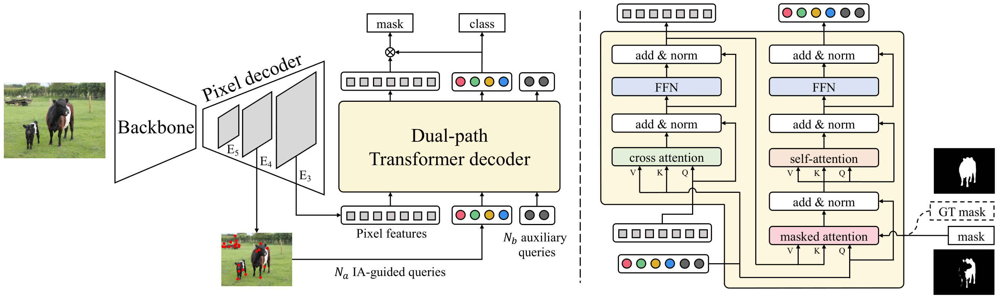
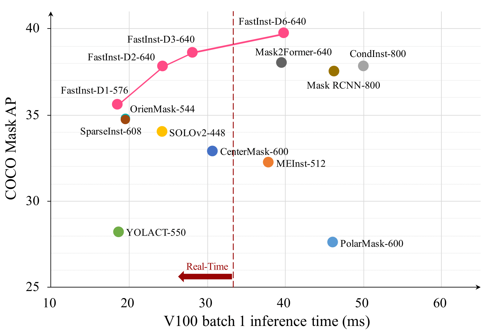

# FastInst Segmentation

Real-time instance segmentation: every object in an image, with its own pixel mask, fast enough to run live.

FastInst is a query-based model built on Detectron2. This repository is the full workflow around it: configs, training, COCO evaluation, dataset preparation, cost analysis, and a demo for images, video, and webcam.

<p align="center">
  
</p>

<p align="center">
  
</p>

| Up to 40.5 mask AP | Up to 53.8 FPS on a V100 | From 30M parameters | Image, video, and webcam |
| --- | --- | --- | --- |

## What this is for

Instance segmentation has to name every object and paint a mask for each one. The accurate models are often too slow to ship, and the fast ones drop mask quality. FastInst keeps both: a small set of instance-guided queries, a high-resolution mask head, and a Detectron2 training loop you can actually run.

## What you can do with it

- Train and evaluate from one entry point, `train_net.py`, on one GPU or many.
- Swap backbones without rewriting the model: ResNet-50, ResNet-101, and ResNet-50d with deformable convolutions.
- Run a pretrained checkpoint on a still image, a video, or a webcam.
- Prepare COCO, ADE20K, panoptic, and semantic segmentation data in the layout Detectron2 expects.
- Measure compute with `tools/analyze_model.py` before you commit to a training run.
- Inspect COCO annotations in a few seconds with `tools/sample_coco_data.py`.

## How it works

1. A backbone extracts image features.
2. The pixel decoder builds a high-resolution map for masks.
3. Instance activation-guided queries tell the transformer decoder where objects actually are, so the model stays fast.
4. Each query returns a category, a box, and a mask.
5. `train_net.py` owns the Detectron2 trainer, the matcher, the loss, and COCO evaluation.

```text
configs/          model and dataset configs
datasets/         COCO and ADE20K preparation
demo/             image, video, and webcam inference
fastinst/         model, data mappers, criterion, evaluators
tools/            FLOPs, conversion, boundary AP, dataset sampling
train_net.py      training and evaluation
```

## Models

COCO instance segmentation. Checkpoints load through `MODEL.WEIGHTS` with the matching config in this repo.

| Model | Backbone | Input | AP | Params | FPS (V100) | Checkpoint |
| --- | --- | ---: | ---: | ---: | ---: | --- |
| FastInst-D1 | R50 | 576 | 35.6 | 30M | 53.8 | [weights](https://github.com/junjiehe96/FastInst/releases/download/v0.1.0/fastinst_R50_ppm-fpn_x1_576_34.9.pth) |
| FastInst-D3 | R50 | 640 | 38.6 | 34M | 35.5 | [weights](https://github.com/junjiehe96/FastInst/releases/download/v0.1.0/fastinst_R50_ppm-fpn_x3_640_37.9.pth) |
| FastInst-D3 | R101 | 640 | 39.9 | 53M | 28.0 | [weights](https://github.com/junjiehe96/FastInst/releases/download/v0.1.0/fastinst_R101_ppm-fpn_x3_640_38.9.pth) |
| FastInst-D1 | R50-d-DCN | 576 | 38.0 | 30M | 47.8 | [weights](https://github.com/junjiehe96/FastInst/releases/download/v0.1.0/fastinst_R50-vd-dcn_ppm-fpn_x1_576_37.4.pth) |
| FastInst-D3 | R50-d-DCN | 640 | 40.5 | 35M | 32.5 | [weights](https://github.com/junjiehe96/FastInst/releases/download/v0.1.0/fastinst_R50-vd-dcn_ppm-fpn_x3_640_40.1.pth) |

The strongest accuracy setting is FastInst-D3 with ResNet-50d-DCN at 40.5 AP. The fastest setting is FastInst-D1 with ResNet-50 at 53.8 FPS and 35.6 AP.

## Run it

```bash
git clone https://github.com/smadduri9/fastinst-segmentation.git
cd fastinst-segmentation
```

Environment setup is in [INSTALL.md](INSTALL.md). After that:

```bash
export DETECTRON2_DATASETS=/path/to/datasets

python demo/demo.py \
  --config-file configs/coco/instance-segmentation/fastinst_R50_ppm-fpn_x1_576.yaml \
  --input path/to/image.jpg \
  --output demo-output \
  --opts MODEL.WEIGHTS path/to/fastinst_R50_ppm-fpn_x1_576_34.9.pth
```

Evaluate:

```bash
python train_net.py \
  --eval-only \
  --num-gpus 1 \
  --config-file configs/coco/instance-segmentation/fastinst_R50_ppm-fpn_x1_576.yaml \
  MODEL.WEIGHTS path/to/fastinst_R50_ppm-fpn_x1_576_34.9.pth
```

Train:

```bash
python train_net.py \
  --num-gpus 1 \
  --config-file configs/coco/instance-segmentation/fastinst_R50_ppm-fpn_x1_576.yaml
```

COCO layout:

```text
$DETECTRON2_DATASETS/coco/
├── annotations/instances_train2017.json
├── annotations/instances_val2017.json
├── train2017/
└── val2017/
```

## Stack

Python, PyTorch, Detectron2, CUDA, OpenCV, and COCO-format datasets.

## Citation

Architecture and reported COCO numbers follow [FastInst: A Simple Query-Based Model for Real-Time Instance Segmentation](https://arxiv.org/abs/2303.08594).

```bibtex
@article{he2023fastinst,
  title={FastInst: A Simple Query-Based Model for Real-Time Instance Segmentation},
  author={He, Junjie and Li, Pengyu and Geng, Yifeng and Xie, Xuansong},
  journal={arXiv preprint arXiv:2303.08594},
  year={2023}
}
```

## License

[MIT](LICENSE). This project builds on FastInst, Detectron2, DETR, and Mask2Former.
